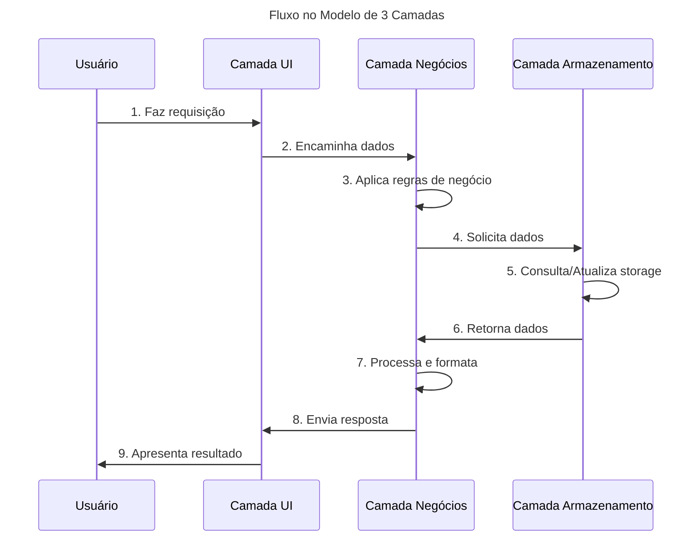

# Modelo de camadas para criação de software

## **Explicação das Camadas:**

### **1. Camada de Apresentação (UI)**
- **Função:** Interface com o usuário
- **Componentes:** Telas, formulários, componentes visuais
- **Responsabilidades:**
  - Capturar entrada do usuário
  - Apresentar dados formatados
  - Validações de interface

### **2. Camada de Negócios**
- **Função:** Coração da aplicação
- **Componentes:** Serviços, Controladores, Regras
- **Responsabilidades:**
  - Aplicar regras de negócio
  - Processar e transformar dados
  - Orquestrar operações
  - Validações de negócio

### **3. Camada de Armazenamento**
- **Função:** Persistência de dados
- **Componentes:** Repositórios, DAOs, APIs
- **Responsabilidades:**
  - CRUD (Create, Read, Update, Delete)
  - Acesso a arquivos ou bancos de dados
  - Integração com serviços externos

## **Vantagens do Modelo:**
- ✅ **Separação de responsabilidades**
- ✅ **Manutenibilidade**
- ✅ **Testabilidade**
- ✅ **Reutilização de código**
- ✅ **Escalabilidade**

O diagrama mostra o fluxo unidirecional de dados, onde cada camada só se comunica com a camada adjacente, mantendo o princípio de baixo acoplamento.
