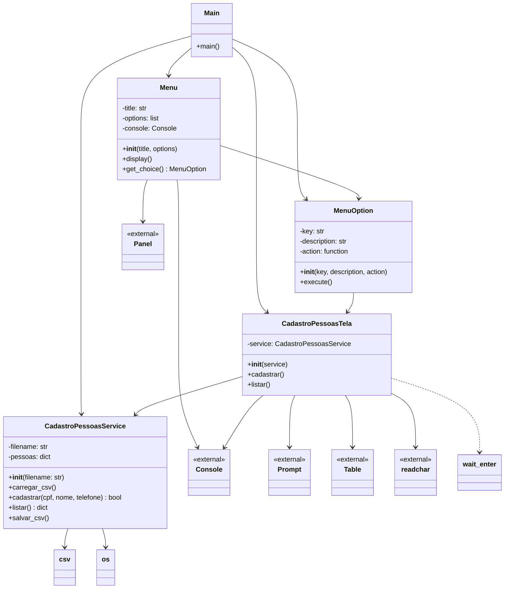

# Criando uma Agenda simples POO

A aplicação faz o cadastro (inserir, listar) de pessoas e salva em um arquivo texto .csv

Código da aplicação disponível em https://github.com/ufpi-lp/lp2025-2/tree/main/agenda

## Estrutura da aplicação 

```bash
agenda
├── 🚀 main.py (Entry point)
├── 📦 app/
│   ├── cadastro.py (CadastroPessoasService)
│   └── text/rich/
│       └── telas.py (UI Components)
└── 📊 dados/
    └── pessoas.csv (Data storage)
```

**Estrutura funcional**
```bash
agenda
├── main.py (▶️ EXECUÇÃO)
├── 📦 PACOTE APP
│   ├── 🎯 SERVIÇOS
│   │   └── cadastro.py
│   └── 🎨 INTERFACE (UI)
│       └── text/rich/telas.py
└── 💾 DADOS
    └── pessoas.csv
```

A estrutura mostra uma organização clara seguindo os princípios de separação de responsabilidades:
- **main.py**: Ponto de entrada
- **app/**: Pacote principal da aplicação
- **app/cadastro.py**: Camada de serviço/lógica de negócio
- **app/text/rich/telas.py**: Camada de apresentação (UI)
- **dados/**: Camada de persistência/dados

## Diagrama UML de classes representando a estrutura do programa:



## Explicação do Diagrama:

### Classes Principais:
- **Main**: Ponto de entrada da aplicação
- **CadastroPessoasService**: Lógica de negócio para cadastro de pessoas
- **CadastroPessoasTela**: Interface do usuário para operações de cadastro
- **Menu**: Sistema de menus interativo
- **MenuOption**: Representa uma opção do menu

### Relacionamentos:
- **Associação**: `Main` usa `CadastroPessoasService`, `CadastroPessoasTela`, `Menu` e `MenuOption`
- **Composição**: `Menu` contém múltiplas `MenuOption`
- **Agregação**: `CadastroPessoasTela` referencia `CadastroPessoasService`
- **Dependência**: Várias classes dependem de bibliotecas externas (rich, readchar, csv, os)

### Fluxo de Dados:
1. `Main` coordena toda a aplicação
2. `Menu` gerencia a navegação do usuário
3. `MenuOption` executa ações que chamam métodos de `CadastroPessoasTela`
4. `CadastroPessoasTela` interage com `CadastroPessoasService` para operações de dados
5. `CadastroPessoasService` gerencia o armazenamento em CSV

O diagrama mostra uma arquitetura bem organizada com separação clara entre interface do usuário, lógica de negócio e persistência de dados.

## Explicação dos Arquivos do Programa

### 🚀 **main.py** - Ponto de Entrada da Aplicação

**Função**: Arquivo principal que inicia e coordena toda a aplicação.

**Responsabilidades**:
- Criar as instâncias principais do sistema
- Configurar o menu de opções
- Gerenciar o loop principal da aplicação
- Orquestrar a comunicação entre componentes

**Fluxo Principal**:
```python
# 1. Inicializa o serviço e a tela
service = CadastroPessoasService()
tela = CadastroPessoasTela(service)

# 2. Define as ações do menu
def cadastrar_pessoa(): tela.cadastrar()
def listar_pessoas(): tela.listar()
def sair(): service.salvar_csv()

# 3. Cria e exibe o menu em loop
menu = Menu("Menu de Cadastro de Pessoas", options)
while True:
    menu.display()
    selected_option = menu.get_choice()
    selected_option.execute()
```

---

### 📦 **app/cadastro.py** - Camada de Serviço e Lógica de Negócio

**Classe Principal**: `CadastroPessoasService`

**Responsabilidades**:
- Gerenciar o cadastro de pessoas na memória
- Persistir dados em arquivo CSV
- Validar regras de negócio (ex: CPF duplicado)

**Métodos Principais**:

### `__init__(self, filename)`
- Inicializa o dicionário de pessoas
- Carrega dados existentes do CSV

### `carregar_csv(self)`
```python
# Lê o arquivo CSV e popula o dicionário em memória
if os.path.exists(self.filename):
    with open(self.filename, "r", encoding="utf-8") as f:
        reader = csv.DictReader(f)
        for row in reader:
            cpf = row["CPF"]
            self.pessoas[cpf] = {"nome": row["Nome"], "telefone": row["Telefone"]}
```

### `cadastrar(self, cpf, nome, telefone)`
- Verifica se CPF já existe (evita duplicatas)
- Adiciona pessoa ao dicionário
- Retorna `True` se sucesso, `False` se CPF duplicado

### `listar(self)`
- Retorna todo o dicionário de pessoas
- Usado pela tela para exibir dados

### `salvar_csv(self)`
```python
# Salva todos os dados no arquivo CSV
with open(self.filename, "w", newline="", encoding="utf-8") as f:
    writer = csv.writer(f)
    writer.writerow(["CPF", "Nome", "Telefone"])  # Cabeçalho
    for cpf, dados in self.pessoas.items():
        writer.writerow([cpf, dados["nome"], dados["telefone"]])
```

---

### 🎨 **app/text/rich/telas.py** - Camada de Apresentação (UI)

### **Classe `MenuOption`**
**Responsabilidade**: Representar uma opção do menu
```python
class MenuOption:
    def __init__(self, key, description, action):
        self.key = key        # Ex: "1", "2", "s"
        self.description = action  # Texto descritivo
        self.action = action       # Função a ser executada
```

### **Classe `Menu`**
**Responsabilidade**: Gerenciar a exibição e navegação do menu

**Métodos**:
- `display()`: Limpa tela e exibe menu formatado
- `get_choice()`: Captura e valida escolha do usuário

### **Classe `CadastroPessoasTela`**
**Responsabilidade**: Interface específica para cadastro de pessoas

**Métodos**:

#### `cadastrar(self)`
```python
# Fluxo de cadastro:
1. Solicita CPF, nome e telefone via Prompt
2. Verifica se CPF já existe (via service)
3. Se não existe, cadastra via service.cadastrar()
4. Exibe mensagem de sucesso/erro
5. Aguarda ENTER para continuar (wait_enter())
```

#### `listar(self)`
```python
# Fluxo de listagem:
1. Obtém dados do service.listar()
2. Se vazio: exibe mensagem "Nenhuma pessoa cadastrada"
3. Se há dados: cria tabela formatada com Rich
4. Exibe tabela com colunas: CPF, Nome, Telefone
5. Aguarda ENTER para continuar
```

### **Função `wait_enter()`**
**Responsabilidade**: Controlar pausa na execução
- Usa biblioteca `readchar` para capturar tecla ENTER
- Mantém tela visível até usuário pressionar ENTER

---

### 💾 **dados/pessoas.csv** - Armazenamento Persistente

**Formato**:
```csv
CPF,Nome,Telefone
123.456.789-00,João Silva,(11) 9999-8888
987.654.321-00,Maria Souza,(21) 7777-6666
```

**Características**:
- Codificação UTF-8 para suporte a acentos
- Formato CSV padrão com cabeçalho
- Persistência entre execuções do programa

---

### 🔗 **Arquivos __init__.py** - Pacotes Python

**Função**: Transformar diretórios em pacotes Python importáveis

**Estrutura**:
```python
# app/__init__.py
# app/text/__init__.py  
# app/text/rich/__init__.py
# dados/__init__.py

# Permitem imports como:
from app.cadastro import CadastroPessoasService
from app.text.rich.telas import Menu, CadastroPessoasTela
```

---

### 📋 Fluxo Completo da Aplicação

1. **Inicialização** (`main.py`)
   - Cria service e tela
   - Carrega dados do CSV para memória

2. **Menu Principal** (`telas.py` - Menu)
   - Exibe opções formatadas
   - Captura escolha do usuário

3. **Cadastro** (`telas.py` - CadastroPessoasTela + `cadastro.py`)
   - Coleta dados do usuário
   - Valida no service
   - Armazena em memória

4. **Listagem** (`telas.py` - CadastroPessoasTela + `cadastro.py`)
   - Recupera dados do service
   - Exibe em tabela formatada

5. **Persistência** (`cadastro.py`)
   - Salva automaticamente ao sair
   - Carrega automaticamente ao iniciar

Esta arquitetura segue o princípio de **Separation of Concerns**, onde cada componente tem uma responsabilidade bem definida, facilitando manutenção e evolução do sistema.
