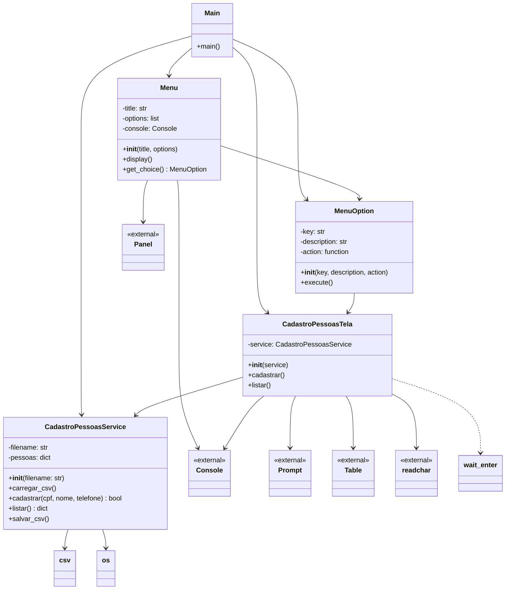

```mermaid
classDiagram
    class Main {
        +main()
    }

    class CadastroPessoasService {
        -filename: str
        -pessoas: dict
        +__init__(filename: str)
        +carregar_csv()
        +cadastrar(cpf, nome, telefone) bool
        +listar() dict
        +salvar_csv()
    }

    class Menu {
        -title: str
        -options: list
        -console: Console
        +__init__(title, options)
        +display()
        +get_choice() MenuOption
    }

    class MenuOption {
        -key: str
        -description: str
        -action: function
        +__init__(key, description, action)
        +execute()
    }

    class CadastroPessoasTela {
        -service: CadastroPessoasService
        +__init__(service)
        +cadastrar()
        +listar()
    }

    class Console {
        <<external>>
    }

    class Panel {
        <<external>>
    }

    class Prompt {
        <<external>>
    }

    class Table {
        <<external>>
    }

    class readchar {
        <<external>>
    }

    %% Relacionamentos
    Main --> CadastroPessoasService
    Main --> CadastroPessoasTela
    Main --> Menu
    Main --> MenuOption
    
    Menu --> MenuOption
    Menu --> Console
    Menu --> Panel
    
    CadastroPessoasTela --> CadastroPessoasService
    CadastroPessoasTela --> Console
    CadastroPessoasTela --> Prompt
    CadastroPessoasTela --> Table
    CadastroPessoasTela --> readchar
    
    MenuOption --> CadastroPessoasTela
    
    CadastroPessoasService --> csv
    CadastroPessoasService --> os

    %% Dependências de métodos
    CadastroPessoasTela ..> wait_enter
```
